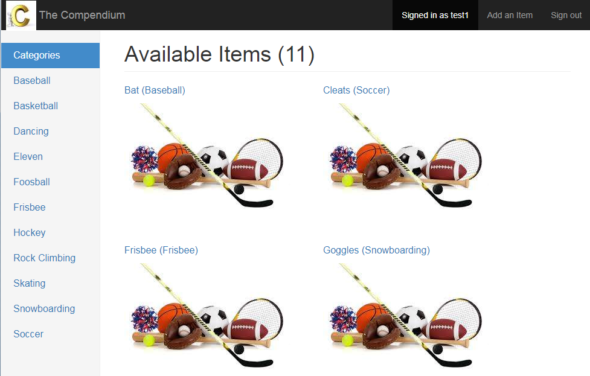
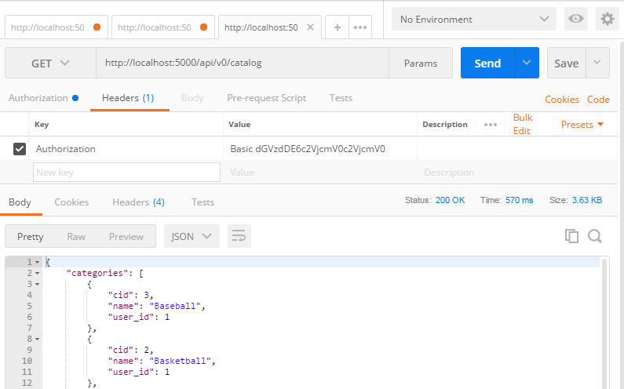

# Item Catalog Application Project
## Project 4

### Project Purpose and Notes
This project allows the creation of an item catalog.  An optional database_setup.py script is included to populate the database with example sports items.  The catalog has a web interface (for humans) and an API interface (for programs).  The web interface supports creating local accounts or using an external Google account by leveraging OAuth2.  The API interface currently only supports local authentication.  In addition, the API supports exchanging local credentials for a Token to support speedier access.  Both the web and API interfaces support CRUD (Create/Read/Update/Delete) functionality.  The API interface however currently allows access to more of the database tables then the web interface.  The one exception is that image uploading currently only works through the web interface.
Note:  The web application uses [Bootstrap v3.x](https://getbootstrap.com/docs/3.3/) and is based on the dashboard example template.

### Installation and Requirements
* Install [VirtualBox](https://www.virtualbox.org/wiki/Downloads)
* Install [Vagrant](https://www.vagrantup.com/downloads.html)
* Clone [this](https://github.com/sockduct/UdacityFullStackVM) repository with git
* From the repo's vagrant directory, run:  `vagrant up`
* Login to the VM:  `vagrant ssh`
* Change to the catalog project directory:  `cd /vagrant/catalog`
* Optionally populate the database:  `python database_setup.py`
* Launch the application:  `python views.py`
  * Note:  The script cannot be run directly because it has Windows-style line endings

### Project Requirements
* The project implements a JSON endpoint that serves the same information as displayed in the HTML endpoints for an arbitrary item in the catalog
* Website reads category and item information from a database ([SQLite](https://www.sqlite.org) used)
* Website includes a form allowing users to add new items and correctly processes submitted forms
* Website includes a form to edit/update a current record in the database table and correctly processes submitted forms
* Website includes a function to delete a current record
* Create, delete and update operations consider authorization status prior to execution
* Page implements a third-party authentication & authorization service ([Google OAuth2/OpenID Connect](https://developers.google.com/identity/protocols/OAuth2) used)
* Site has a 'Login' and 'Logout' button/link
* Code complies with [PEP 8 style guide](https://www.python.org/dev/peps/pep-0008/)
* README (this file) and good comments in code

### Project Solution Layout
#### views.py (Program Layout)
* Web Interface (Human using Browser)
  * show_catalog - Display all categories and items in the database
  * show_category - Show single category and items within that category
  * show_item - Show single item with additional detail
  * add_item - Form to add an item, requires authenticated user/session (cookie used for this)
  * edit_item - Form to edit an existing item, requires authenticated user/session, user may only edit items he/she created
  * delete_item - Form to delete an existing item, requires authenticated user/session, user may only delete items he/she created
* API Interface (Programmatic Access)
  * create_category_api - Create a new category name (currently only possible via API or direct database access), requires username/password or token using HTTP basic authentication, accepts/outputs JSON
  * create_item_api - Create a new item, requires authentication, only single item creation (as opposed to a list of multiple items) currently supported, accepts/outputs JSON
  * show_catalog_api - Output all categories and items, outputs JSON
  * read_category_api - Output individual category, accepts JSON (pass in category ID number), outputs JSON
  * read_item_api - Output individual item, accepts JSON (pass in item ID number), outputs JSON
  * read_item_picture_api - Output picture file, doesn't currently work
  * update_category_api - Update existing category (rename), requires authentication, user must be category creator, accepts JSON (pass in category ID number and new category name), outputs JSON
  * update_item_api - Update existing item, requires authentication, user must be item creator, accepts JSON (pass in item ID number and new item name, new item description, new item category name (must currently exist)), outputs JSON
  * update_item_picture_api - Not yet implemented...
  * delete_category_api - Delete existing category, requires authentication, user must be category creator, accepts JSON (pass in category ID number), outputs JSON
  * delete_item_api - Delete existing item, requires authentication, user must be item creator, accepts JSON (pass in item ID number), outputs JSON
* Authentication Functions
  * verify_password - API authentication verification for username/password or token
  * get_auth_token - Requires authentication, returns identity token for user which lasts one hour
  * get_resource - Test API, requires authentication, returns basic user info for authenticated session
  * signin - Web authentication form supporting local and OAuth2/OpenID Connect (Goolge) authentication
  * signout - Logout
  * signup - Web for to create local account
  * gconnect - Handle OAuth2 login using Google as provider
  * gdisconnect - Handle OAuth2 logout using Google as provider
  * disconnect - Generic logout dealing with different providers (Local/Google)
#### models.py (Program Layout)
* User - SQLAlchemy user model (database fields and supporting methods)
* Category - SQLAlchemy category model
* Item - SQLAlchemy item model
#### helpers.py (Program Layout)
* Various helper functions support views.py

### Example Project Output
* Web Interface (e.g., using Chrome):
  
* API Interface (e.g., using Postman):
  

### License
[MIT License](license.txt)

