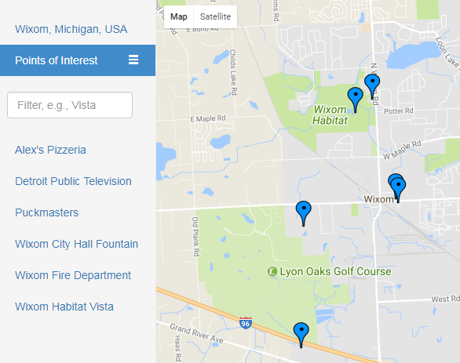

# [Udacity](https://www.udacity.com/) [Full Stack Web Developer NanoDegree](https://www.udacity.com/course/full-stack-web-developer-nanodegree--nd004) Projects

* [Project 1 - x](Project1)

=======

# Neighborhood Map Project
## Project 5

### Project Overview
This project leverages the [Knockout Framework](http://knockoutjs.com/), the [Google Maps API](https://developers.google.com/maps/), and the [Flickr API](https://www.flickr.com/services/api/) to create a mashup showcasing interesting places within small area such as a city.  Knockout manages the selection menu bar allowing the user to pick any one of the points of interest and showing relevant information on the map of the area.  The Google Maps JavaScript library manages the map and everything on it, with available photos from Flickr added to popup windows if available.
##### Notes:
* The web application uses [Bootstrap v3.x](https://getbootstrap.com/docs/3.3/) and is based on the dashboard example template.
* [This article on Bootstrap Sidebars](https://bootstrapious.com/p/bootstrap-sidebar) was used as a reference to help make the menu bar collapsable and starting open/collapsed depending on the screen size.

### Installation and Requirements
* Clone [my project 5 GitHub repo](https://github.com/sockduct/FSND-Project-5)
* Obtain a [Flickr API Key](https://www.flickr.com/services/api/misc.api_keys.html)
* Create the file js/keys.js with your Flickr API Key in the following format:
  * `var flickrAPIKey = '<your-key>';`
* Run a local web server to server the host index.html, places.json (points of interest data file), the CSS, Fonts, Img, and JS directories:
  * Python 2.x:  `python -m SimpleHTTPServer`
  * Python 3.x:  `python -m http.server`
  * Note: The default port is 8000, and can be changed by adding a port at the end:
    *  `python -m <http-server-library> 8080`
* Open the index.html file

### Project Requirements
* Use Knockout to handle the menu including list/filter functionality
* Handle API access asynchronously with graceful error handling including user notification
* Use the Google Maps API to load a full screen map
* Display at least 5 markers on the map which are also controlled by the menu list/filter
* Leverage a third party API (Flickr Photos used) to provide additional information about the points of interest (markers) when clicked
* Animate the map marker when it's selected via the map or menu list
* Add relevant information to the popup window displayed when clicking on a point of interest/marker
* Create intuitive web application interface
* README (this file) and good comments in code

### Project Solution Layout
#### index.html (Web Application Entry Point)
#### css folder
* dashboard.css - Started from Bootstrap v3 dashboard template and CSS provided from the Google Maps API Udacity class to create this custom CSS
* bootstrap.min.css - Minified Bootstrap v3.3.7 standard CSS file
### js folder
* menu.js - code to control application menu nav sidebar using knockout
* wixom-map.js - code to invoke Google Maps API dynamic (JavaScript) library and places library, load photos from Flickr API, open popups for points of interest (per Google Maps API - infowindows)
* keys.js - hold API keys (not provided to secure Flickr API key)
* jquery-3.2.1.min.js - jQuery library
* bootstrap.min.js - Bootstrap v3.3.7 standard JavaScript library
* knockout-3.4.2.js - Knockout Framework code

### Example Project Output
* Web Interface (e.g., using Chrome):

  

### License
[MIT License](license.txt)

